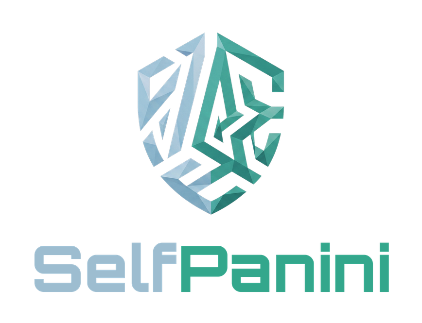

  

  <h1>SelfPanini — WM 2026 Sammelalbum</h1>

  
<b>Sticker abhaken · Fehlende & Doppelte verwalten · mit Freunden tauschen.</b>

  

    <a href="https://panini.selfcoder.de">🌐 panini.selfcoder.de</a>
  

---

## Deutsch

Einfacher, kinderfreundlicher Sammel-Tracker für das WM-2026-Sammelalbum (980 Sticker: 48 Teams à 20 + Glitzer FCW 00–19). Eine einzige HTML-Datei — kein Konto, keine Anmeldung.

- **Antippen** = hab ich (grün) · **nochmal** = doppelt (gelb) · **lange drücken** = zurück
- **Fortschritt** live, je Team und gesamt; Team komplett → Teal-Belohnung
- **Teilen**: Listen „fehlt / doppelt" per WhatsApp + **Tausch-Link** mit automatischem Abgleich
- **Backup** speichern/laden (Umzug zwischen Geräten)
- Speicherung lokal im Browser (kein Server)

## English

Simple, kid-friendly collection tracker for the FIFA World Cup 2026 sticker album (980 stickers: 48 teams × 20 + glitter FCW 00–19). A single HTML file — no account, no sign-in.

- **Tap** = have it (green) · **tap again** = duplicate (yellow) · **long-press** = undo
- **Progress** per team and overall; a completed team gets a teal reward
- **Share** missing / duplicate lists via WhatsApp + a **trade link** with automatic matching
- **Backup** export/import (move between devices)
- Stored locally in the browser (no server)

---

  Inoffizieller Sammelhelfer · nicht mit Panini verbunden. Flaggen: flagcdn.com

